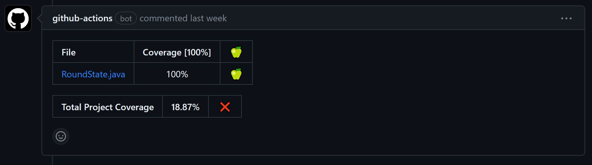

# JaCoCo Mavennel és Github Actionsszel

## Kódlefedettség

A kódlefedettség mérése számomra nem volt triviális feladat, így utána kellett olvasnom a lehetséges megoldásoknak. Találtlam arra opciót, hogy az egyes IDE-k beépített tooljaival hogyan lehet a JUnit tesztek kódlefedettségét kimutatni, de ezt a munkafolyamatot kéksőbb a felhőbe szerettem volna mozgatni, ezért semmilyen mértékben nem hagyatkozhattam az IDE nyújtota lehetőségekre.

### JaCoCo

Végül a JaCoCo-ra esett a választásom, hivatalos dokumentáció, egyéb blogok/weboldalak és természetesen a Stack Overflow segítségével kiismertem magam ezen a toolon. Ezek után már nem volt nehéz feladat a pom.xml fájlt kiegészíteni, hogy a tesztek és a coverage a megfelelő parancs hatására lefussanak. A JaCoCo többféle kiterjesztésben generál reportot, ezek közül számomra a html fájl volt a leghasznosabb (legkönnyebben megnyitható/olvasható), de a következő lépésben leírtak alapján a többire is szükség volt.

## Github Actions

Találtam egy olyan actiont, amely a workflow végén a kigenerált JaCoCo reportokból kigyűjti az információt, és az aktuális pull requesthez kommentben odakommenteli az eredményt. Meg lehet neki adni a minimum code coverage szintet, ami alatt piros x-szel jelzi, a hiányos teszteket. A workflow és a coverage report generálás egy minimális összehangolást igényelt, hogy az action a megfelelő helyen keresse a reportot.

Az egyes fájlok lefedettségét illetően idő híján nem sikerült azt a bugot megtalálni, ami miatt kevés fájlt vesz csak "megváltozottnak", érdemes a "Total Project Coverage" pontból tájlkozódni egyelőre.
