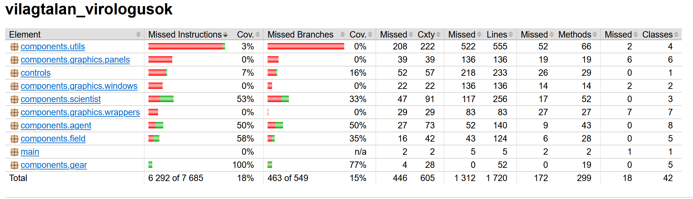

# Unit tesztek írása a projekthez

## Unit tesztek

A szoftver Java nyelvre épül. Ezért a unit teszteléshez a JUnit keretrendszert választottuk. A egyik legnépszerűbb tesztelési keretrendszer Java nyelven íródott projektekhez. A JUnit lehetővé teszi, hogy a fejlesztők könnyen írhassanak teszt esetek és, hogy ezeket azonnal tudják futtatni. A projektben egyáltalán nem szerepelt előtte unit tesztelés. Ez nyílván nem  nem jó, mivel a unit tesztelésnek az a célja, hogyha a programban elkészül egy kis komponens, akkor azt azonnal meg lehet nézni, hogy jól implementáltuk. Így a projekt korai szakaszában tudjuk detektálni az esetleges hibákat. 

Azt a feladatot tűztem ki magam elé, hogy a projektben az üzleti logikához tartozó osztályok nagy részét leteszteljem. A unit teszt alkalmával, abba is bele láttam, hogy melyik osztály rendelkezik túl sok felelősséggel(isten osztály). Ezeket egy éles projekt keretén belül tudtam volna, jelezni a fejlesztőknek, hogy bontsák szét a felelősségeket. Egyrészt azért, mert a szoftver karbantarthatósága és bővíthetősége nehézkes lesz és a unit tesztelést se segíti, ha egy 1000 soros osztályt kell letesztelni. Mivel az egységtesztek hatékonyabbak és olvashatóbbak lesznek, ha az osztályok kisebb méretűek és jól elkülönülnek a felelősségi területek szerint.

Nagyon érdekes volt egy olyan projektnek a unit tesztelését elvégezni, amit nem én írtam. Így sokkal többrt néztem a projekt dokumentációját, hogy milyen bemenetre egy adott függvénynek milyen kimenetet kell adnia. Illetve, hogy egy adott függvénynek, mi lenne a szerepe. Sokszor kijött ilyen esetekben, hogy a projekthez tartozó eredeti dokumentáció nem volt teljes ilyen szempontból. Ez ugyancsak megnehezítette a unit tesztek készítését. Mivel nehezebb volt meghatározni a helyes bemeneteket és kimeneteket a tesztekhez. Egy éles projekt során jeleztem volna a fejlesztőknek, hogy bővítsék ki a dokumentációjukat, hogy egyértelműbb legyen milyen bemenetre, milyen kimenetet kell, hogy kapjunk.

A unit tesztek írásánál minden osztályhoz írtam egy teszt osztályt. A teszt osztályban minden tesztesetet @Test annotációval láttam el. Az eggyes teszteseteket úgy próbáltam szétbontani, hogy minden különböző paraméterű lefutáshoz tartozzon egy külön teszt. Ez segít a hiba helyének detektálásában. Továbbá próbáltam arra is figyelni, hogy ahol volt elágazás az eredeti metódusban, ott mindkét ágat leteszteljem ezzel növelve a kód lefedettséget. 

## Unit tesztelést támogató eszközök

A projektünk Maven build rendszert használ. Ez az egységtesztelést is jelentősen megkönnyíti. Számos hasznos funkcióval rendelkezik, mely kényelmessebbé teszi a fejlesztést. Az egyik nagyon hasznos funkció az volt számomra a maven által biztosított automatikus futtatása a teszteknek. Ehhez a projekt mappájába navigálva a konzolból ki kell adni az mvn test parancsot. Ez a projektben szereplő összes tesztet lefuttatja. Mivel a Maven-hez hozzá lett adva `jacoco-maven-plugin`. Így a fenti parancs hatására generált egy html riportot is, amely tartalmazta az összes osztály kódlefedettségét. Ez nagyon hasznosnak bizonyult a tesztek írása során, mert nyomon tudtam követni, hogy melyik osztály nincs még letesztelve teljesen. 

Továbbá hasznos funkciónak találtam, hogy a Maven segítségével, amikor beérkezett a repositoryba egy pull request, az azonnal lefutatta az általam írt teszteket. Ez rengeteg időt és energiát spórol meg. A pipeline automatikusan végzi a tesztek futtatását, így én koncetrálhatok csak a tesztek eredményére. Továbbá a gyors visszajelzés a tesztek eredményéről és a kódlefedettségről szintén nagyon hasznos funkció. 

