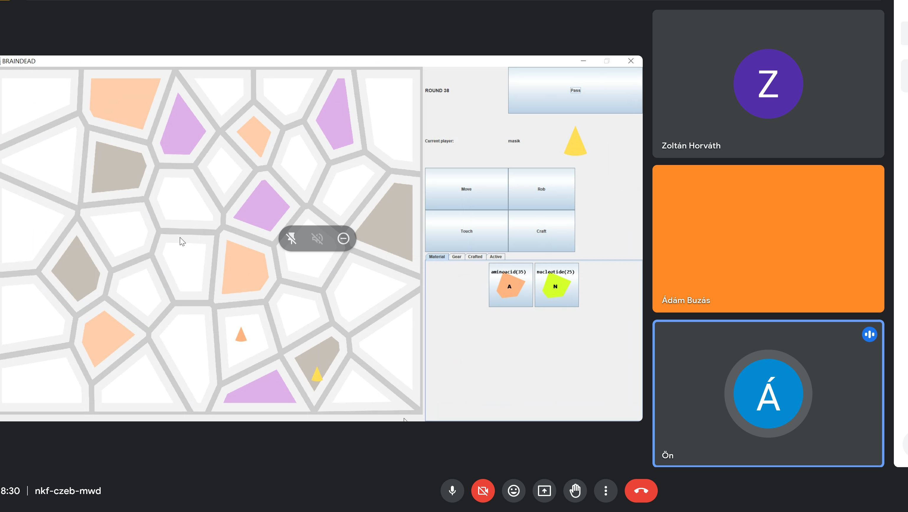

# Usability

## Elvégzett munka
Hárman csináltunk egy google meetet, és közösen végigjátszottuk a játékot. Közben összegeztük a tapasztalatainkat, és javaslatokat dolgoztunk ki a szoftver minőségének javítása érdekében. A szoftver beszerzésétől kezdve (letöltés, telepítés) a teljes folyamatot kipróbáltuk.

Kihasználtuk, hogy hárman dolgozunk a feladaton, ezzel próbáltuk a felhasználók sokszínűségét szimulálni. Mindannyiunk meglátásait összegeztük. A dokumentáció menete az volt, egy fő játékmenet megosztott képernyővel, ezen felül egy másik megnyitott játékmenetben a kezelhetőséget ellenőriztük. A dokumentációt egy ember írta, de közösen megmeszéltük a tartalmát.

Úgy gondoljuk, hogy sikerült sok gondolatot összeszedni, amivel a szoftver használhatóságát javítatni tudnánk. Azt tapasztaltuk, hogy a nehézkes kezelés miatt ingerültek lettünk, így a játék nem töltötte be a szerepét (kikpacsolódás, szórakozás).

Megtanultuk, hogy nehéz úgy UI-t tervezni, hogy a UX is jó legyen. A felhasználók sokszínűsége már hármunknál is nagyon látható volt, nagyon játékosbázis esetén sokkal figyelmesebbnek kell lenni, hogy az igényeknek megfeleljen a szoftver.